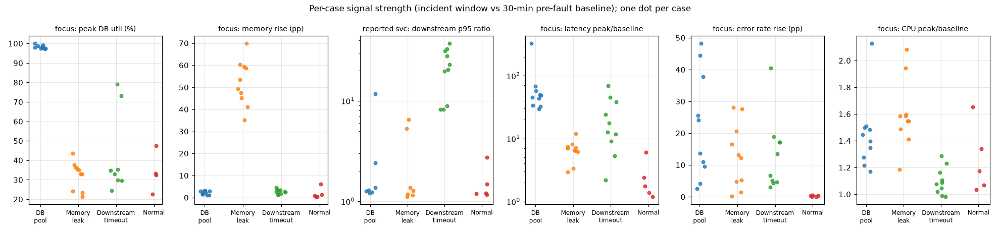
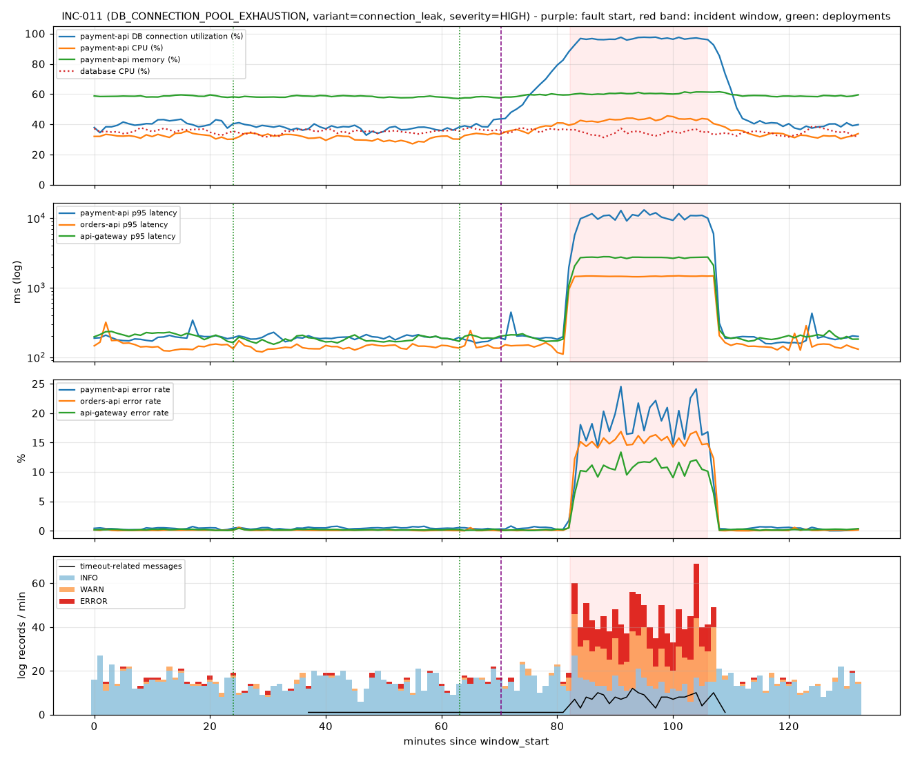
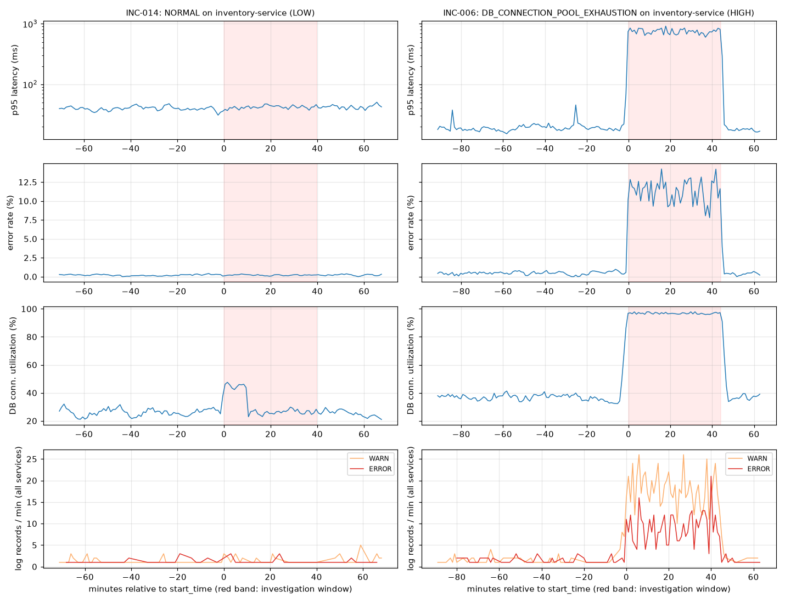
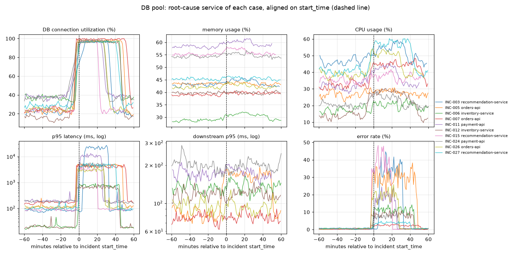
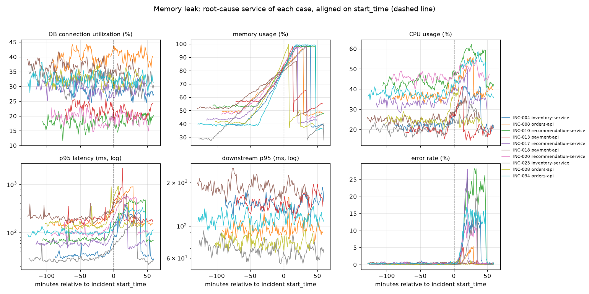
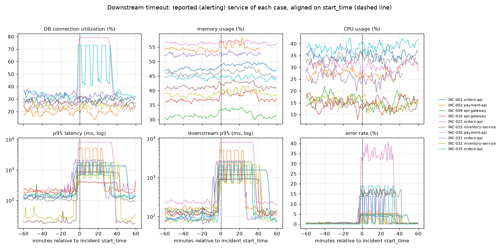
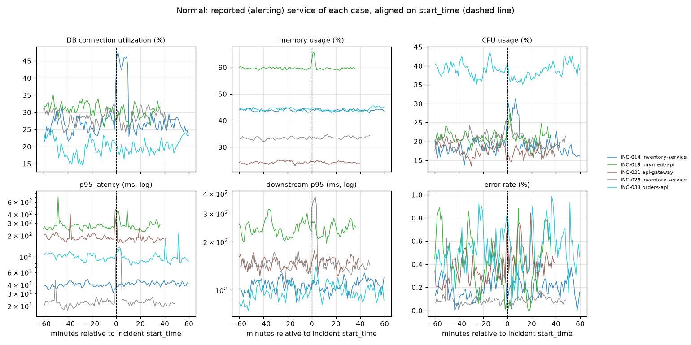

# Dataset Analysis (Day 3)

This report examines the synthetic dataset from Day 2 (`data/`) before any parsing or modelling starts. All numbers come from `analysis/explore_dataset.py`, which only reads the data. You can regenerate them with `python analysis/explore_dataset.py`.

The full results are in `analysis/results/`:
- `summary.json`
- `tables.md`
- `metric_stats_focus_service.csv`
- `metric_stats_all_rows.csv`
- `incident_signals.csv`
- `normal_cases.csv`
- `keyword_presence.csv`

The figures are in `analysis/figures/`.

**Result:** the dataset shows the intended scenario behaviour, and no ground-truth label leaks into the logs or descriptions.

The analysis found three metadata shortcuts: the amount of data before the alert, NORMAL alert duration, and NORMAL severity. Each one gave away the scenario on its own. The generator was changed minimally to remove them, and the dataset was regenerated with the same seed. The ground-truth labels of all 35 incidents are unchanged; see [Generator change](#generator-change-made-during-day-3). The dataset is ready for Day 4, with the limitations listed at the end.

## Definitions used in this analysis

- **Focus service.** For DB pool and memory-leak cases, this is the ground-truth `root_cause_service`. For downstream-timeout and NORMAL cases, it is the reported (alerting) `service`, because the downstream root cause is often an external provider with no metrics.
  - Ground truth is used here only to describe the data. The RCA engine must not see it.
- **Baseline.** The 30 minutes before `fault_start_time`. NORMAL cases have no fault, so their baseline is the 30 minutes before `start_time`.
- **Incident window.** From `start_time` to `end_time`.
- **Onset.** The first minute of a run of at least 2 consecutive minutes above a threshold.
  - The thresholds are: DB utilization 75%; memory rising 10 pp above baseline; latency ≥ 2× baseline; error rate ≥ 1 pp above baseline; timeout logs above baseline.
- **Log template.** A message with numbers and hex identifiers replaced by `#`.

## 1. Dataset summary

| Item | Value |
|---|---|
| Cases | 35: 10 `DB_CONNECTION_POOL_EXHAUSTION`, 10 `MEMORY_LEAK`, 10 `DOWNSTREAM_SERVICE_TIMEOUT`, 5 `NORMAL` |
| Log records | 98,252: INFO 74,820 (76.2%), WARN 14,374 (14.6%), ERROR 9,058 (9.2%); no other levels |
| Metric rows | 34,254 (one row per service per minute) |
| Services | 6 in both logs and metrics: api-gateway, orders-api, payment-api, inventory-service, recommendation-service, database |
| Time span | 2026-01-08 23:33 to 2026-03-16 21:30 (UTC) |
| Blank metric values | `db_connection_utilization`: 5,709, all api-gateway rows. `downstream_latency_ms`: 11,418, all database and recommendation-service rows. These are "not applicable" by design, not missing data. |
| Data before `start_time` | 64.9–128.9 min per case |
| Case window length | 109–219 min |
| Log records per case | DB 2,458–4,297; memory 1,654–3,920; downstream 1,998–4,714; NORMAL 1,592–2,354 |

## 2. Scenario distribution

| | DB pool | Memory leak | Downstream timeout | NORMAL |
|---|---|---|---|---|
| Variants | connection_leak 3, pool_misconfig 3, slow_query 2, traffic_surge 2 | library_regression 3, listener_leak 3, session_retention 2, unbounded_cache 2 | provider_degraded 4, network_latency 2, dependency_overloaded 2, dependency_slow 2 | traffic spike, GC pause burst, latency blip, dependency blip, slow query burst (1 each) |
| Root-cause service | recommendation 3, orders 3, inventory 2, payment 2 | orders 3, recommendation 3, inventory 2, payment 2 | inventory 3, acquirer-gateway 2, recommendation 2, warehouse-api 2, payment 1 | none |
| Reported service | orders 4, recommendation 3, payment 2, inventory 1 | recommendation 3, inventory 2, api-gateway 2, orders 2, payment 1 | orders 4, payment 2, api-gateway 2, inventory 2 | inventory 2, payment 1, api-gateway 1, orders 1 |
| Severity | CRITICAL 4, HIGH 4, MEDIUM 2 | CRITICAL 4, MEDIUM 3, HIGH 2, LOW 1 | MEDIUM 5, HIGH 3, CRITICAL 2 | LOW 4, MEDIUM 1 |
| Duration (min) | 19.3–50.1 (mean 34.9) | 19.7–59.1 (mean 35.8) | 22.6–46.7 (mean 34.0) | 7.5–39.7 (mean 26.4) |

## 3. Metric behaviour per scenario (focus service)

Each cell shows the mean with the standard deviation in brackets, taken over all per-minute rows of the focus service in all cases of the scenario. The min–max ranges for every cell are in `analysis/results/tables.md`.

| Metric | DB baseline | DB incident | Memory baseline | Memory incident | Downstream baseline | Downstream incident | NORMAL baseline | NORMAL incident |
|---|---|---|---|---|---|---|---|---|
| cpu_usage (%) | 30.1 (10.2) | 38.4 (13.0) | 30.9 (9.3) | 39.7 (13.2) | 25.4 (8.8) | 24.3 (10.0) | 23.4 (7.8) | 24.6 (7.9) |
| memory_usage (%) | 44.8 (8.4) | 44.0 (8.0) | 45.7 (7.7) | **84.5** (19.0) | 44.7 (7.7) | 45.5 (6.9) | 41.1 (11.9) | 43.1 (9.5) |
| request_rate (req/s) | 114.9 (39.4) | 155.7 (77.7) | 117.7 (61.0) | 120.0 (53.3) | 132.0 (98.0) | 149.3 (108.7) | 115.7 (76.8) | 102.4 (66.1) |
| latency_ms (p95) | 107.4 (58.2) | **4,951.8** (5,346.4) | 110.9 (62.3) | 313.8 (222.8) | 134.2 (70.0) | **1,812.3** (2,179.9) | 122.3 (92.7) | 104.8 (101.6) |
| error_rate (%) | 0.4 (0.2) | **15.1** (12.2) | 0.2 (0.2) | 6.4 (7.5) | 0.3 (0.2) | **10.1** (9.7) | 0.3 (0.2) | 0.3 (0.2) |
| db_connection_utilization (%) | 27.1 (7.6) | **97.1** (2.2) | 29.3 (6.9) | 28.1 (6.8) | 27.1 (4.6) | 36.8 (19.2) | 26.4 (4.7) | 27.0 (6.9) |
| downstream_latency_ms (p95) | 123.1 (42.7) | 134.5 (41.4) | 119.0 (38.0) | 111.0 (38.5) | 123.5 (45.3) | **2,203.2** (2,079.9) | 145.7 (52.4) | 145.1 (62.5) |

`analysis/results/metric_stats_all_rows.csv` gives the same statistics over every service. It is useful for seeing how the fault spreads into callers.

### Scenario checks

Each check is counted per incident; the data for them is in `incident_signals.csv`.

**DB pool exhaustion (10 cases)**

| Check | Result |
|---|---|
| DB utilization ≤ 75% at baseline and ≥ 90% at peak | 10/10 |
| Latency peak ≥ 2× baseline | 10/10 (ratio 29.6–325.5) |
| Error rate rises ≥ 1 pp | 10/10 (+2.6 to +48.2 pp) |
| Timeout-related WARN/ERROR rate above baseline | 10/10 (0.32–7.33/min, against 0.00–0.03/min at baseline) |
| CPU ratio smaller than both the DB-utilization ratio and the latency ratio | 10/10 (CPU ratio 1.17–2.13) |
| CPU peak ≥ 2× baseline | 1/10 (INC-012, traffic surge) |
| Memory change within ±5 pp | 10/10 |

**Memory leak (10 cases)**

| Check | Result |
|---|---|
| Memory rises ≥ 15 pp | 10/10 (+35.3 to +69.9 pp) |
| Leak phase is a gradual trend (linear-fit R² ≥ 0.9) | 10/10 (R² 0.97–1.00) |
| No single jump (largest 1-minute step < 10% of the total rise) | 10/10 (0.02–0.05) |
| Latency peak ≥ 1.5× baseline | 10/10 (2.97–11.90×) |
| Spearman correlation between memory and latency ≥ 0.5 | 9/10 (0.49–0.92; INC-028 is 0.49) |
| Error rate rises ≥ 1 pp | 9/10 (INC-018, severity LOW, rises only +0.21 pp) |
| Error onset comes after memory onset | 9/10 (INC-018 has no error onset) |
| DB utilization peak < 60% | 10/10 |
| OOM-kill events | 3/10 (INC-013, INC-023, INC-028) |

**Downstream service timeout (10 cases)**

| Check | Result |
|---|---|
| Downstream p95 on the reported service ≥ 2.5× baseline | 10/10 (8.2–37.2×) |
| Timeout-related WARN/ERROR rate above baseline | 10/10 (0.47–11.85/min, against 0.00/min at baseline) |
| Error rate on the reported service rises ≥ 1 pp | 10/10 (+3.1 to +40.5 pp) |
| CPU peak < 1.3× baseline | 10/10 (0.98–1.29×) |
| Memory change < 5 pp | 10/10 (+1.2 to +4.5 pp) |
| DB utilization peak < 90% (no pool saturation) | 10/10. The highest value is 79.2%, in INC-030, where the caller holds DB connections while it waits on the slow call. |

**NORMAL (5 cases)**

| Check | Result |
|---|---|
| No service has error rate > 2% at any minute | 5/5 (maximum 1.25%) |
| No DB utilization ≥ 90% | 5/5 (maximum 49.6%) |
| WARN logs present | 5/5 (82–107 per case) |
| Latency fluctuates (CV > 0.05 on the alerting service) | 5/5 (CV 0.08–0.71) |

NORMAL cases also carry 43–90 background ERROR logs each, so "has ERROR logs" does not mean "has a fault".

### Event ordering

This measures the time of each signal's onset relative to the primary signal: DB utilization for DB, memory for memory leak, and downstream latency for downstream timeout. Signals with the same onset minute are joined with `=`.

| Scenario | Orderings (number of cases) | Primary onset after the fault | Lag after the primary signal |
|---|---|---|---|
| DB pool | `latency=primary < error` 5; `error=latency=primary` 5 | 2.0–19.7 min | latency 0 min; errors 0–1 min; timeout logs −10.3 to +1.4 min |
| Memory leak | `primary < latency < error` 8; `primary < error < latency` 1; `primary < latency`, with no error onset, 1 | 10.4–27.7 min | latency 17–87 min; errors 25–98 min; timeout logs 32–118 min (6 cases) |
| Downstream | `latency=primary < error` 5; `error=latency=primary` 4; `primary < latency < error` 1 | 0.1–1.2 min | latency 0–1 min; errors 0–6 min; timeout logs 0.1–5.2 min |

The memory-leak ordering is clearly separated from the others. For DB and downstream cases, the signals start within the same minute or one minute apart at 1-minute metric resolution. Log timestamps have millisecond precision, so the order of log events can add detail there.

A negative timeout-log lag in DB cases means individual timeout logs appear before utilization has stayed above 75% for 2 minutes. This is expected when the pool is close to saturation.

## 4. Variation analysis

| Aspect | Observation |
|---|---|
| Timestamps | All 35 start times are unique. They cover 2026-01-08 to 2026-03-16 and 17 different start hours across scenarios, from 01:00 to 22:00. |
| Incident duration | Coefficient of variation (CV) is 0.31 for DB, 0.36 for memory and 0.22 for downstream. NORMAL durations (7.5–39.7 min) overlap failure durations (19.3–59.1 min). |
| Alert lag (from `fault_start_time` to `start_time`; ground truth) | DB 4.6–15.8 min; memory 38.3–105.8 min; downstream 2.0–10.2 min |
| Baselines | CPU 14.2–46.6% (DB), 19.9–46.0% (memory), 14.2–37.7% (downstream). Request rate 37.9–173.5 req/s (DB), 25.9–210.3 (memory), 37.6–359.2 (downstream). Latency 18–217 ms. |
| Severity | 3–4 levels in each failure scenario; see section 2. |
| Affected services | 4–5 root-cause services and 4–5 reported services per scenario. The alert often fires on a caller, such as api-gateway or orders-api. |
| Request rate | This is the main traffic-surge signal: DB incident request rate reaches 350 req/s against a baseline maximum of 183. |
| Magnitudes | Peak latency CV is 1.09 for DB, 0.83 for memory and 1.04 for downstream. Peak error-rate CV is 0.74–0.85. |
| Messages | Unique ERROR templates: 98 (DB), 76 (memory), 79 (downstream). Mean pairwise Jaccard similarity of ERROR-template sets between incidents of the same scenario is 0.42 (DB), 0.42 (memory) and 0.48 (downstream), with a maximum of 0.71. |
| Event ordering | See [Event ordering](#event-ordering). The order is consistent within a scenario, but the lags vary widely. |

## 5. Artificially easy patterns

| Check | Result |
|---|---|
| Ground-truth label strings, such as `MEMORY_LEAK` or `connection_leak`, in log messages | 0 |
| Metric rows repeated across incidents | 0 |
| Root-cause words in `description` (pool, connection, memory, leak, heap, OOM, downstream, provider, network, dependency) | 0 in every scenario |
| An ERROR template that appears in every incident of one scenario and in no other scenario | 0 for every scenario |
| Best scenario-exclusive template | Covers 30% of DB cases, 30% of memory cases and 40% of downstream cases |
| Data before the alert, alert duration and severity as scenario hints | Fixed; see below |

Share of cases with at least one WARN/ERROR log matching each keyword:

| Keyword | DB pool | Memory leak | Downstream | NORMAL |
|---|---|---|---|---|
| timeout / timed out / deadline | 1.00 | 0.70 | 1.00 | 0.40 |
| `Database connection timeout` | 0.80 | 0.20 | 0.30 | 0.40 |
| pool | 1.00 | 1.00 | 1.00 | 0.80 |
| heap / GC | 1.00 | 1.00 | 1.00 | 1.00 |
| OOM / out of memory | 0.00 | 0.50 | 0.00 | 0.00 |
| HTTP 503 / 502 / 504 | 1.00 | 0.90 | 1.00 | 0.20 |
| circuit breaker / ejecting | 0.30 | 0.00 | 0.30 | 0.00 |
| retry | 0.90 | 0.90 | 1.00 | 1.00 |

No keyword appears in all cases of one scenario and in none of the others. "OOM" appears only in memory-leak cases but covers just half of them. The engine has to combine the rate of these messages with the metrics, rather than detect whether a keyword is present.

### Generator change made during Day 3

On the original Day 2 data, the analysis found three shortcuts where one metadata field gave away the scenario:

| Shortcut | Before (original data) | After (regenerated data) |
|---|---|---|
| Minutes of data before `start_time` | Memory leak 80.8–144 against 41–76.6 for every other scenario, so the ranges did not overlap | DB 66.2–121.2, memory 71.7–128.9, downstream 64.9–126.5, NORMAL 70.5–119.0 |
| NORMAL alert duration | 4.6–14.0 min against at least 19.3 min for every failure, so the ranges did not overlap | 7.5–39.7 min, overlapping failures |
| NORMAL severity | Always LOW (5/5), while only 1 of 30 failures was LOW | LOW 4, MEDIUM 1 |

The change in `scripts/generate_logs.py` is small:
- Every case draws its data-before-alert length from the same range (`PRE_ALERT_MINUTES`, 60–130 min). Each planner places the fault backwards from `start_time`.
  - Memory leaks keep their 35–110 min growth phase and at least 20 min of pre-fault baseline.
- A NORMAL alert now stays open until it is acknowledged, 3–30 min after the blip ends.
- NORMAL severity is now computed by the same impact-based `severity_of` rule as failures. INC-029's 6.06× latency spike therefore rates MEDIUM.

Case planning did not change: the incident IDs, the scenario of each ID, and the target service, dependency and variant. For all 35 incidents, `scenario`, `true_root_cause`, `root_cause_service` and `root_cause_variant` are identical before and after regeneration.

Because the data was regenerated, timestamps, values, derived text and file checksums changed:
- `fault_start_time` and other timestamps;
- metric values and log lines;
- `expected_symptoms` text and file checksums;
- INC-029's severity.

Failure durations did not change. Running the generator again with seed 42 produces byte-identical output.

## 6. Representative incidents

**INC-011: DB pool exhaustion, connection leak on payment-api (HIGH).**
- Two unrelated deployments come before the fault; they are the green lines in the figure.
- Pool utilization then climbs gradually from 37.9% to 97.7%. The p95 latency on payment-api rises 68.1× and errors rise 24.1 pp.
- Timeout-related logs go from 0 to 7.33/min.
- CPU rises only 1.50× and memory stays flat.
- orders-api and api-gateway see the latency and errors second-hand.

**INC-034: memory leak, unbounded cache on orders-api (CRITICAL).**
- Memory rises 60.4 pp over 62 minutes, almost linearly (R² 1.00).
- The Spearman correlation between memory and latency is 0.92. Latency reaches 3.37× baseline and errors rise 16.5 pp.
- This is the one memory case where the error onset (45.4 min) comes before the latency onset (50.4 min). Both come well after memory starts rising (10.4 min).

**INC-030: downstream timeout, acquirer-gateway degraded, reported by payment-api (CRITICAL).**
- Downstream p95 rises 37.2× and errors rise 40.5 pp.
- Timeout logs reach 11.85/min.
- CPU stays at 1.05× and memory rises only 1.3 pp.
- payment-api holds DB connections while it waits on the provider, so DB utilization reaches 79.2% without saturating.

**INC-029: NORMAL, dependency blip on inventory-service (MEDIUM).**
- p95 latency spikes 6.06× (CV 0.71), but the maximum error rate is 0.85% and DB utilization peaks at 49.6%.
- It is the hardest benign case: its latency ratio overlaps several memory-leak and downstream cases, but nothing is sustained.

**INC-014 against INC-006: benign traffic spike and slow-query pool exhaustion on the same service (inventory-service).**
- The traffic spike raises DB utilization to about 47% for about 10 minutes. Latency and error rate stay flat.
- The pool exhaustion saturates the pool, raises latency to about 800 ms, and adds about 10–14% errors.

### Metric comparison per scenario

Each panel shows every incident of the scenario on its focus service, aligned on `start_time` (dashed line).

## 7. Realism observations and limitations

What looks realistic:
- The fault spreads through the call graph, so callers see timeouts and 5xx errors.
- The alert often fires on a caller rather than on the faulty service.
- Background noise appears in every case: WARN logs, unrelated deploys, cron jobs, GC bursts and isolated ERROR logs.
- Error wording depends on each service's stack.
- DB utilization rises moderately during downstream incidents, and some downstream incidents are intermittent.

Limitations to keep in mind:
- **Signals separate more clearly than in production.**
  - Peak DB utilization of 97–100% appears only in DB incidents.
  - Memory rises of 35–70 pp appear only in memory leaks.
  - Downstream ratios are highest in downstream incidents (8.2–37.2×).
  - A simple rule-based detector could score very well on this data. High accuracy here should not be read as evidence that the engine would work on real incidents.
- **Memory growth is smoother than in real systems.** The leak phase fits a straight line with R² 0.97–1.00, and no single minute exceeds 5% of the rise. Real JVM and Node heaps show GC sawtooth patterns, and restarts reset them.
- **One-minute metric resolution.** DB and downstream signals start within the same minute or one minute apart, so ordering can separate the memory leak from the others but not DB from downstream. Logs have millisecond timestamps.
- **Small sample.** There are 4 variants per scenario, 6 services and 2 external dependencies. The 5 NORMAL cases give limited coverage of benign behaviour; the 6 NORMAL blip types are not all represented.
- **Some case features are ground truth.** `fault_start_time`, alert lag, `root_cause_*`, `expected_symptoms`, `affected_services` and `resolution` must never reach the RCA engine.
- **Description wording.** "timing out" appears in 4 DB, 1 memory and 1 downstream description, and "timeout" in 2, 3 and 2 respectively. Neither appears in a NORMAL description. This is a weak hint that a case is a failure, but not of which scenario.
- **Two memory cases are weak**, which is intentional:
  - INC-018 (LOW) barely raises errors (+0.21 pp).
  - INC-028 has a memory–latency correlation of only 0.49 and includes an OOM kill.
  - These cases are useful tests for the engine.

## 8. Day 4 readiness

**Ready.** The structure is stable, the IDs link correctly, the validator passes 21/21, and the data is deterministic. Notes for the parsing and normalization milestone:

- Read logs with `pandas.read_json(path, lines=True)`. Timestamps are UTC with millisecond precision.
- Metric timestamps are whole minutes.
- Treat blank `db_connection_utilization` (api-gateway) and `downstream_latency_ms` (database, recommendation-service) as "not applicable", not as zero.
- Split the incident metadata into context fields (`service`, `severity`, `start_time`, `end_time`, `window_*`, `title`, `description`) and ground-truth fields before ingestion.
- Use a fixed lookback relative to `start_time` rather than the full case window, and do not use duration or severity as evidence.
- Template normalization, replacing numbers and hex identifiers with `#`, already reduces ERROR messages to 76–98 templates per scenario. This is a reasonable starting point for log grouping.
